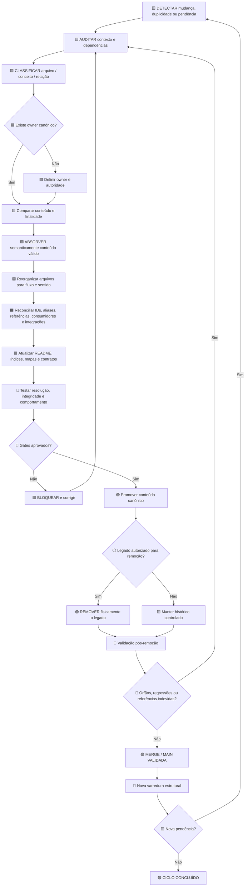
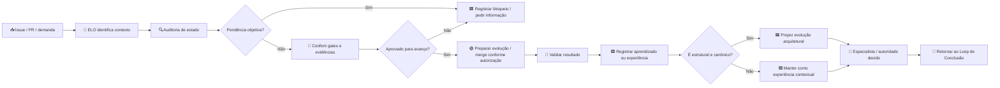
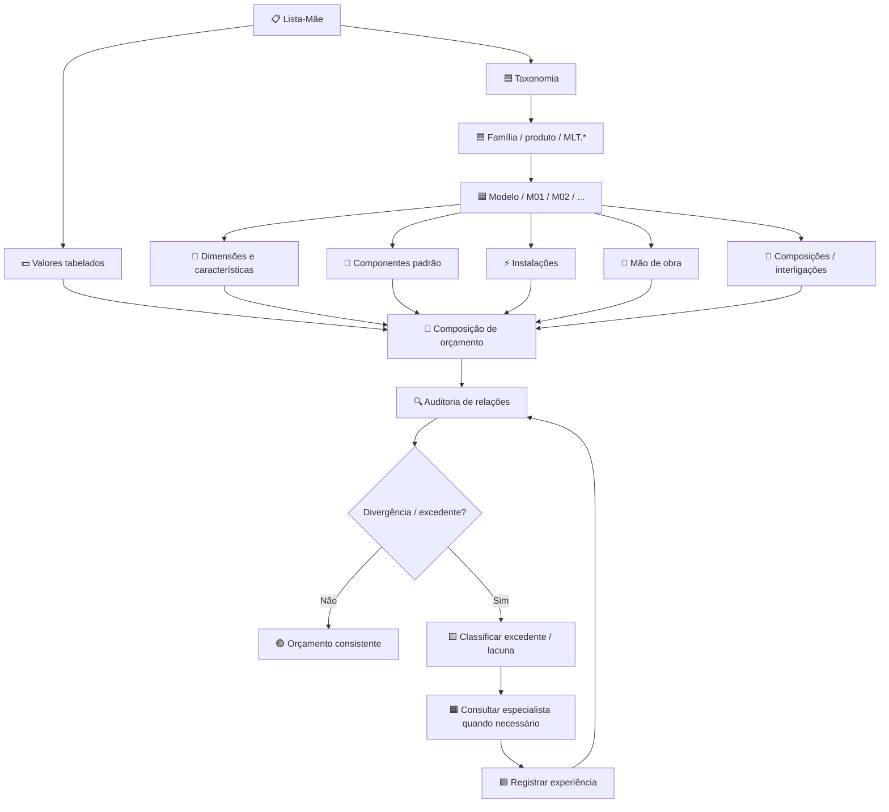
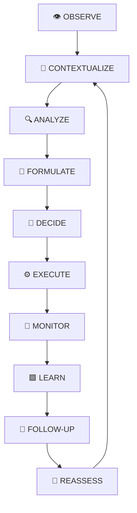

# 🧠 Cognitico_IA-corporative

> **Fonte operacional oficial do ecossistema ELO.**
>
> O ELO é uma plataforma cognitiva empresarial governada para integrar contexto, conhecimento, evidências, memória, experiências, especialistas e sistemas, apoiando decisões humanas autorizadas sem substituir a autoridade dos sistemas de registro ou dos gestores.

## 🧭 Mapa rápido do ELO

| Símbolo | Significado | Uso no ELO |
|---|---|---|
| 🟦 | **Canônico / estrutural** | arquitetura, contratos, owners e identidade |
| 🟩 | **Operacional / validado** | implementação, execução e capacidade comprovada |
| 🟨 | **Atenção / análise** | hipótese, lacuna, divergência, auditoria ou pendência |
| 🟥 | **Bloqueio / não autorizado** | conflito, falha de gate, risco ou ação sem autorização |
| 🟪 | **Conhecimento / experiência** | conhecimento contextual, memória e aprendizado governado |
| 🟧 | **Integração / especialista** | interação com sistemas, agentes e especialistas |
| ⚪ | **Legado / histórico** | conteúdo que deve ser auditado antes de remoção |
| 🔵 | **Gate / evidência** | teste, validação, aprovação e evidência executável |
| 🟢 | **Concluído / promovido** | estado validado e incorporado ao fluxo canônico |

### Regra visual fundamental

**🟨 analisar → 🟦 decidir a autoridade → 🟪 absorver conhecimento quando aplicável → 🔵 validar → 🟢 promover → ⚪ remover legado somente quando permitido.**

---

## 🏛️ Diretriz arquitetural atual

O repositório é a base documental e operacional do **ELO Enterprise Integration Platform (EIP)**, preservando a separação entre arquitetura canônica, implementação executável, conhecimento, dados, governança, agentes e integrações.

O objetivo é evoluir o ELO de uma base cognitiva governada para uma plataforma capaz de receber contexto empresarial, evidências e experiências de múltiplos domínios, raciocinar sobre relações entre setores e orientar decisões humanas sem substituir a autoridade do gestor.

### Princípios não negociáveis

- 🟦 **Um único Core canônico** — não criar um segundo Core.
- 🟦 **Uma única autoridade por conceito** — não criar memória, catálogo ou autoridade paralela sem contrato explícito.
- 🟨 **Sem invenção de fatos** — ausência de evidência deve permanecer como lacuna, hipótese ou incerteza.
- 🟪 **Experiência não vira regra automaticamente** — experiência contextual somente pode ser promovida após avaliação, generalização, validação e gate.
- 🔵 **Evidência antes de promoção** — documentação ou código isolados não significam prontidão operacional.
- 🟧 **Especialista como autoridade contextual** — o ELO coordena, questiona, cruza e registra; não elimina a responsabilidade técnica do especialista.
- 🟩 **Sistemas de registro continuam sendo sistemas de registro** — ELO integra ERP, MES, CRM e demais fontes sem assumir artificialmente sua autoridade.
- 🟥 **Escrita, execução e mudança estrutural exigem autorização e governança.**

---

# 🔄 Loop de Conclusão — manutenção lógica permanente

O **Loop de Conclusão** é uma diretriz permanente de manutenção arquitetural do ELO. Ele deve ser usado para duplicidades, consolidação de pastas, migração de artefatos, evolução de contratos, aposentadoria de legado, atualização de índices e qualquer mudança que possa alterar a autoridade do ecossistema.



### Regra de saída

O ELO **não declara o ciclo concluído enquanto existir uma etapa necessária pendente**.

A remoção física do legado faz parte do loop, mas somente pode ocorrer depois de:

1. 🟨 auditoria do conteúdo;
2. 🟦 definição do owner canônico;
3. 🟪 absorção semântica do conteúdo relevante;
4. 🟧 reconciliação das relações e consumidores;
5. 🔵 testes e gates aprovados;
6. 🟢 promoção do conteúdo canônico;
7. 🟢 remoção controlada do legado;
8. 🔵 validação pós-remoção;
9. 🟢 merge e validação da `main`;
10. 🔵 nova varredura da árvore.

**Nunca remover somente porque dois nomes são semelhantes.** A decisão é semântica, estrutural e baseada em evidência.

---

# 🤖 Auto-coordenação de manutenção

O ELO possui uma diretriz de **auto-coordenação de manutenção lógica**: quando uma evolução fica parada em Issue, PR, validação ou revisão, o processo deve identificar o estado real, verificar dependências e gates e determinar o próximo passo permitido.



### Interação ELO ↔ especialista

Quando uma evolução depende de conhecimento técnico, o ELO deve entrar no assunto com o especialista ligado ao domínio. Exemplo conceitual:

> **ELO:** “Identifiquei uma oportunidade de evolução relacionada a orçamento. Posso dar seguimento para avaliar a adoção desta função?”
>
> **Especialista:** valida, rejeita, corrige ou complementa.
>
> **ELO:** classifica o resultado como decisão estrutural, regra operacional, conhecimento contextual ou experiência.

Uma experiência positiva e de grande valor **não se torna automaticamente uma regra canônica**. Ela deve ser avaliada contra a identidade canônica do ELO antes de qualquer promoção.

---

# 💰 Orçamento, Lista-Mãe e inteligência de relações

A inteligência de orçamento deve funcionar como um **modelo relacional governado**, e não como uma coleção de documentos isolados.

### Relação conceitual



### Princípio operacional

Quando o especialista disser **“orçar”**, **“comparar valores”**, **“montar composição”** ou equivalente, o ELO deve conseguir recuperar automaticamente, quando autorizados e disponíveis:

- família e taxonomia;
- modelo MLT correspondente;
- dimensões e área;
- componentes padrão;
- materiais;
- mão de obra (`ajudante`, `profissional`, `encarregado`);
- composições e interligações;
- parâmetros de instalação;
- valores da Lista-Mãe;
- histórico e experiências relevantes;
- relações já conhecidas entre ambientes, modelos e componentes.

### Excedentes e diferenças

Se uma solicitação corresponder a um modelo conhecido, mas apresentar elementos adicionais, o ELO deve separar:

**modelo-base + excedentes + interligações + diferenças de escopo + lacunas.**

Exemplo:

`MLT.M01 × 5 unidades` + `3 janelas` + `1 divisória` + `tomadas adicionais` + `interligações elétricas`

O modelo-base fornece a configuração padrão. Os excedentes entram como itens adicionais da composição, sem duplicar artificialmente o modelo.

**Valor fechado da Lista-Mãe não deve ser inventado pelo ELO.** Se o preço ainda não estiver disponível, o item deve permanecer identificado e sem valor arbitrário.

---

# 🧱 Estrutura de dados: SQL + documentos

A regra arquitetural é:

> **Dados altamente relacionais e tabeláveis → SQL.**  
> **Regras, explicações, contexto técnico e conhecimento narrativo → documentos.**

### Candidatos naturais para SQL

- produtos e modelos;
- famílias `MLT.*`;
- taxonomias;
- dimensões;
- unidades de medida;
- componentes;
- materiais;
- mão de obra;
- composições;
- interligações;
- relações modelo → componente;
- relações componente → composição;
- valores e vigências;
- versões da Lista-Mãe;
- aliases e identificadores canônicos;
- histórico de alterações estruturadas.

### Candidatos naturais para documentos

- regras de negócio;
- critérios de auditoria;
- justificativas técnicas;
- padrões de classificação;
- decisões arquiteturais;
- experiências contextualizadas;
- explicações de composição;
- conhecimento normativo e técnico.

O ELO deve **relacionar os dois mundos**, preservando provenance e autoridade.

---

# 📐 Base de dimensões de módulos

As dimensões devem ser tratadas como dados estruturados e versionados. A referência atualmente fornecida para a nova configuração é:

| Tamanho | Comprimento | Largura | Altura | Área externa aprox. | Área interna atual |
|---|---:|---:|---:|---:|---:|
| 20 pés | 6000 mm | 2440 mm | **3010 mm** | 14,64 m² | **13,63 m²** |
| 15 pés | 4500 mm | 2440 mm | **3010 mm** | 10,98 m² | — |
| 10 pés | 3000 mm | 2440 mm | **3010 mm** | 7,32 m² | — |
| 8,5 pés | 2600 mm | 2440 mm | **3010 mm** | 6,34 m² | — |
| 8 pés | 2400 mm | 2440 mm | **3010 mm** | 5,86 m² | — |
| 6 pés | 1800 mm | 2440 mm | **3010 mm** | 4,39 m² | — |

> ⚠️ A dimensão **3010 mm** é a referência atualizada informada para o novo modelo. A área interna de **13,63 m²** deve permanecer distinguida da área geométrica externa e ser vinculada ao modelo/configuração correspondente.

---

# 🧩 Taxonomia MLT

A taxonomia deve permitir que uma entrada técnica seja associada ao modelo mais adequado por características, e não apenas por nome.

Exemplo conceitual:

```text
entrada técnica
    ↓
características
    ├── dimensões
    ├── uso
    ├── ambientes
    ├── instalações
    ├── acessibilidade
    ├── componentes
    └── complexidade
    ↓
classificação taxonômica
    ↓
modelo MLT candidato
    ↓
ajustes / excedentes / interligações
    ↓
composição de orçamento
```

A taxonomia conhecida inclui famílias `MLT.M*`, `MLT.C*` e `MLT.E*`. A lista completa deve permanecer em fonte estruturada própria, evitando transformar o README em catálogo operacional.

---

# 🏢 Multiteiner como tenant de validação

A Multiteiner deve ser tratada como **tenant empresarial de validação**, e não como parte do Cognitive Core.

O contexto empresarial pode incluir Comercial, Engenharia, Compras, Financeiro, RH, Produção, Montagem, Manutenção, Qualidade, Logística, Segurança, processos, documentos, conversas, eventos, agentes, especialistas e fontes de dados.

A Lista-Mãe é uma fonte comercial/técnica de referência para orçamento, consulta e composição. Ela não é, isoladamente, a autoridade sobre estoque, compras, produção, financeiro ou realidade operacional. O ELO deve cruzá-la com outras fontes autorizadas e preservar a proveniência.

---

# 🔄 Ciclo cognitivo empresarial



A passagem de leitura para escrita ou execução exige autorização explícita e execução governada.

---

# 🗂️ Estrutura canônica do repositório

A árvore canônica utiliza uma única pasta operacional por família numerada:

- `00-enterprise-manifest/` — fundamentos empresariais e manifesto operacional
- `01-meta-architecture/` — meta-arquitetura operacional
- `02-architecture-library/` — biblioteca de arquitetura
- `03-process-library/` — biblioteca de processos
- `04-knowledge-handbook/` — conhecimento e manuais
- `05-cognitive-platform/` — plataforma cognitiva operacional
- `06-knowledge-engineering/` — engenharia do conhecimento
- `07-data-engineering/` — engenharia de dados e owner canônico
- `08-ai/` — arquitetura e governança de IA
- `09-governance/` — governança corporativa
- `10-adr/` — decisões arquiteturais
- `11-models-library/` — biblioteca de modelos
- `12-system-engineering/` — engenharia de sistemas
- `13-reference-architecture/` — arquitetura de referência
- `14-roadmap/` — roadmap
- `15-assets/` — ativos reutilizáveis
- `Docs/` — documentação evolutiva e registros
- `automation/` — automações
- `forge/` — plano construtor/executável governado
- `src/elo/` — implementação executável do ELO
- `tests/` — testes e evidências executáveis
- `runtime/` — componentes de runtime
- `memory/` — memória e aprendizado governado
- `platform/` — utilidades de plataforma
- `scripts/` — scripts operacionais
- `prompts/` — prompts e contratos auxiliares
- `members/` — artefatos de membros/domínios
- `frontend/` — interface

A existência de uma pasta não determina, sozinha, sua autoridade. A autoridade é determinada pelas regras de navegação, manifestos, ADRs, contratos canônicos, governança e evidências.

---

# 🔁 Regra para duplicidades

Antes de criar um conceito, o ELO deve pesquisar:

- nome exato;
- sinônimos;
- abreviações;
- contrato equivalente;
- ADR equivalente;
- implementação existente;
- teste existente;
- item de roadmap existente.

Classificar como:

`REUSE` · `EXTEND` · `RELOCATE` · `CONSOLIDATE` · `NEW` · `CONFLICT`

`NEW` somente é permitido depois de rejeitadas as demais classificações.

**Não criar nova pasta paralela apenas para obter simetria linguística.** Conteúdo histórico deve ser auditado, semanticamente absorvido e validado antes de qualquer remoção.

---

# 📊 Regra de maturidade

Uma capacidade não deve ser descrita como pronta apenas porque existe documentação ou código.

```text
REQUISITO
   ↓
ARQUITETURA
   ↓
CONTRATO
   ↓
IMPLEMENTAÇÃO
   ↓
TESTE
   ↓
EVIDÊNCIA
   ↓
STATUS OPERACIONAL
```

Estados utilizados pelo ELO:

`PROPOSED` · `DRAFT` · `NORMATIVE` · `IMPLEMENTED` · `TESTED` · `VERIFIED` · `EXPERIMENTAL` · `DEPRECATED` · `SUPERSEDED` · `ROADMAP` · `BLOCKED`

---

# 🛡️ Governança de navegação e IA

Antes de criar ou alterar qualquer artefato, consultar:

1. [`AGENTS.md`](AGENTS.md) — regras operacionais para agentes de IA;
2. [`ELO_REPOSITORY_NAVIGATION_RULES.md`](ELO_REPOSITORY_NAVIGATION_RULES.md) — autoridade, navegação e Loop de Conclusão;
3. [`ELO_ARTIFACT_METADATA_STANDARD.md`](ELO_ARTIFACT_METADATA_STANDARD.md) — identidade, autoridade e maturidade;
4. [`ELO_AI_AGENT_WORKING_RULES.md`](ELO_AI_AGENT_WORKING_RULES.md) — continuidade entre IAs.

Esses documentos orientam navegação, classificação, execução e revisão. Não substituem arquitetura normativa ou ADRs aprovados.

---

# 📚 Consolidação documental validada

As famílias duplicadas auditadas devem obedecer ao princípio de **absorver antes de remover**.

| Família | Owner canônico | Estado |
|---|---|---|
| `00` | `00-enterprise-manifest/` | 🟢 consolidada |
| `05` | `05-cognitive-platform/` | 🟢 consolidada |
| `07` | `07-data-engineering/` | 🟢 consolidada |
| `09` | `09-governance/` | 🟢 consolidada |
| `11` | `11-models-library/` | 🟢 legado removido |
| `12` | `12-system-engineering/` | 🟢 legado removido |
| `14` | `14-roadmap/` | 🟢 legado removido |

A remoção não é baseada somente em nomes semelhantes. O conteúdo deve ser classificado, absorvido, reconciliado e validado antes da retirada física.

---

# 🚦 Critério de decisão do ELO

```text
ENTRADA
  ↓
🟨 O que é isso?
  ↓
🟨 Onde pertence?
  ↓
🟦 Existe owner canônico?
  ├── SIM → reutilizar / estender / consolidar
  └── NÃO → avaliar criação
  ↓
🟪 O conhecimento é contextual ou generalizável?
  ├── Contextual → memória / experiência governada
  └── Generalizável → validar para possível evolução canônica
  ↓
🟧 Precisa de especialista?
  ├── SIM → consultar autoridade do domínio
  └── NÃO → continuar
  ↓
🔵 Gates e evidências
  ↓
🟢 Promoção / merge
  ou
🟥 Bloqueio / correção / nova avaliação
```

---

# 📌 Estado operacional

O ELO deve permanecer em **manutenção contínua orientada por evidência**. O encerramento de uma evolução não encerra a capacidade de detectar novas inconsistências.

A regra permanente é:

> **Detectar → compreender → relacionar → absorver → validar → promover → remover somente quando autorizado → verificar novamente.**

A próxima evolução arquitetural somente deve começar quando a árvore permanecer coerente e o novo artefato possuir owner canônico explícito.

**Fonte normativa principal:** [`ELO_REPOSITORY_NAVIGATION_RULES.md`](ELO_REPOSITORY_NAVIGATION_RULES.md)
